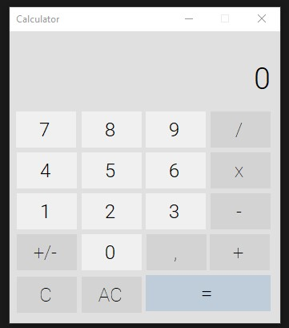
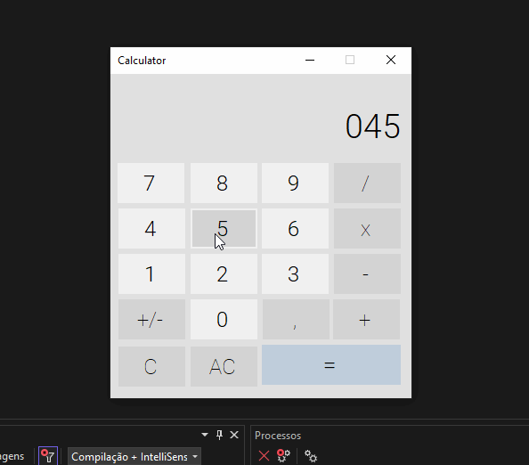

# CALCULATOR

The calculator app is a Windows app written in C# using WinForms.
The app provides standard calculator functionality.

## Features

- Standard Calculator functionality which offers basic operations and evaluates commands immediately as they are entered.

